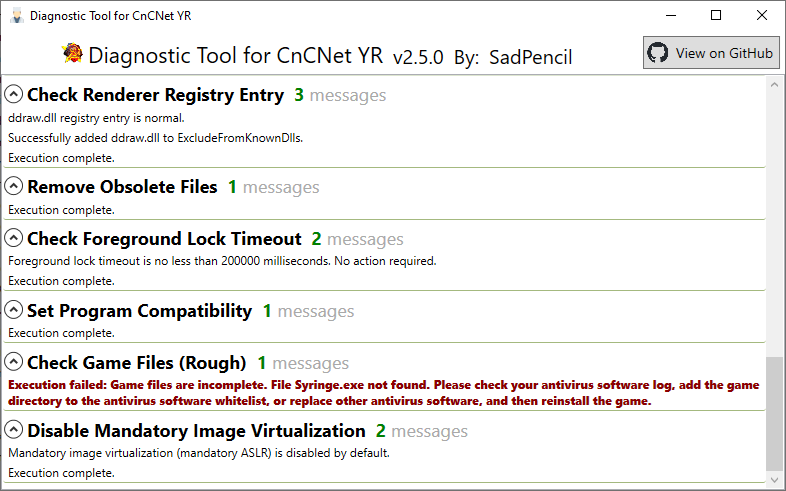

# CnCNet YR Diagnostic Tool

An automated game environment configuration and diagnostic tool for CnCNet YR. With minor modifications, it can be adapted to other Red Alert 2 / Ares / Phobos game mods that are also based on the [xna-cncnet-client](https://github.com/CnCNet/xna-cncnet-client/).

## License

[GPL v3.0](./LICENSE).
